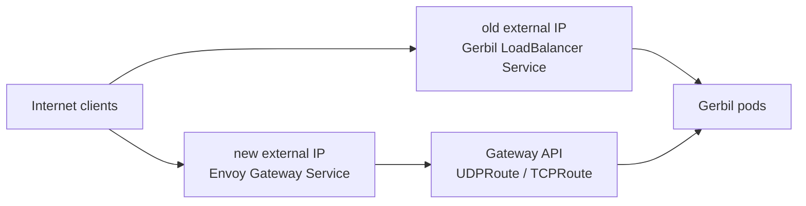

# Gerbil Gateway API Migration

This is the safe rollout shape for moving Gerbil L4 traffic toward Envoy
Gateway without taking the old public address away from the existing Gerbil
`LoadBalancer` Service.

For the shared-IP variant where Gerbil keeps UDP and only HTTP/HTTPS moves from
Traefik to Envoy, see
[shared-ip-http-envoy-migration.md](shared-ip-http-envoy-migration.md).

## Target Shape



Yes, Gerbil can receive traffic from both paths at the same time. The important
constraint is that the same external IP and port cannot normally be owned by the
old Gerbil `LoadBalancer` Service and the Envoy Gateway `LoadBalancer` Service
simultaneously. Start with two public IPs, then move the old IP to Envoy only
when Envoy is the only intended public entrypoint for those ports.

## Prerequisites

- Gateway API experimental CRDs are installed, because `UDPRoute` and `TCPRoute`
  are `gateway.networking.k8s.io/v1alpha2`.
- Envoy Gateway supports the L4 protocols and ports you want to expose.
- Gerbil has a stable in-cluster backend Service that Envoy can route to.
- The old direct `LoadBalancer` Service keeps the old external IP during the
  test phase.

## Services

Keep the old Service that owns the old IP. Use your provider's static-IP
annotation if it does not honor `loadBalancerIP`.

```yaml
apiVersion: v1
kind: Service
metadata:
  name: gerbil-public-old
  namespace: pangolin-system
spec:
  type: LoadBalancer
  loadBalancerIP: OLD_PUBLIC_IP
  externalTrafficPolicy: Local
  selector:
    app.kubernetes.io/name: gerbil
  ports:
    - name: wg-51820
      protocol: UDP
      port: 51820
      targetPort: 51820
    - name: wg-21820
      protocol: UDP
      port: 21820
      targetPort: 21820
    - name: tcp-443
      protocol: TCP
      port: 443
      targetPort: 443
```

Add or reuse a normal in-cluster Service for Envoy's route backend:

```yaml
apiVersion: v1
kind: Service
metadata:
  name: gerbil
  namespace: pangolin-system
spec:
  type: ClusterIP
  selector:
    app.kubernetes.io/name: gerbil
  ports:
    - name: wg-51820
      protocol: UDP
      port: 51820
      targetPort: 51820
    - name: wg-21820
      protocol: UDP
      port: 21820
      targetPort: 21820
    - name: tcp-443
      protocol: TCP
      port: 443
      targetPort: 443
```

## Separate Envoy Gateway IP

Create a Gateway whose Envoy data plane gets its own external IP first. The
exact static-IP field depends on your Envoy Gateway and cloud provider setup;
the example shows only the Gateway API part.

```yaml
apiVersion: gateway.networking.k8s.io/v1
kind: Gateway
metadata:
  name: gerbil-eg
  namespace: envoy-gateway-system
spec:
  gatewayClassName: eg
  listeners:
    - name: gerbil-udp-51820
      protocol: UDP
      port: 51820
      allowedRoutes:
        namespaces:
          from: All
    - name: gerbil-udp-21820
      protocol: UDP
      port: 21820
      allowedRoutes:
        namespaces:
          from: All
    - name: gerbil-tcp-443
      protocol: TCP
      port: 443
      allowedRoutes:
        namespaces:
          from: All
```

## UDPRoute And TCPRoute

Attach routes to the new Gateway and point them at the Gerbil backend Service.

```yaml
apiVersion: gateway.networking.k8s.io/v1alpha2
kind: UDPRoute
metadata:
  name: gerbil-udp-51820
  namespace: pangolin-system
spec:
  parentRefs:
    - group: gateway.networking.k8s.io
      kind: Gateway
      name: gerbil-eg
      namespace: envoy-gateway-system
      sectionName: gerbil-udp-51820
  rules:
    - backendRefs:
        - group: ""
          kind: Service
          name: gerbil
          port: 51820
---
apiVersion: gateway.networking.k8s.io/v1alpha2
kind: UDPRoute
metadata:
  name: gerbil-udp-21820
  namespace: pangolin-system
spec:
  parentRefs:
    - group: gateway.networking.k8s.io
      kind: Gateway
      name: gerbil-eg
      namespace: envoy-gateway-system
      sectionName: gerbil-udp-21820
  rules:
    - backendRefs:
        - group: ""
          kind: Service
          name: gerbil
          port: 21820
---
apiVersion: gateway.networking.k8s.io/v1alpha2
kind: TCPRoute
metadata:
  name: gerbil-tcp-443
  namespace: pangolin-system
spec:
  parentRefs:
    - group: gateway.networking.k8s.io
      kind: Gateway
      name: gerbil-eg
      namespace: envoy-gateway-system
      sectionName: gerbil-tcp-443
  rules:
    - backendRefs:
        - group: ""
          kind: Service
          name: gerbil
          port: 443
```

The controller can emit Gerbil `UDPRoute`s for its managed `ListenerSet` with:

```yaml
- name: CONFIG_GERBIL_UDP_ROUTE
  value: "true"
- name: CONFIG_GERBIL_UDP_PORTS
  value: "51820,21820"
- name: CONFIG_GERBIL_SERVICE_NAME
  value: "gerbil"
```

Use either the controller-managed UDP path or the manual Gateway above for the
same port, not both, unless they attach to different Envoy Gateways/IPs.
`TCPRoute` is currently a manual manifest.

## Validation

Check that both entrypoints exist:

```sh
kubectl -n pangolin-system get svc gerbil-public-old gerbil
kubectl -n envoy-gateway-system get gateway gerbil-eg
kubectl -n pangolin-system get udproute,tcproute
```

Then test clients against the new Envoy external IP while existing clients keep
using the old IP. Watch Gerbil logs and Envoy Gateway route status conditions.

## Cutover

When the Envoy path is validated:

1. Remove or pause the old Gerbil `LoadBalancer` Service so it releases the old
   IP.
2. Assign the old static IP to the Envoy Gateway data-plane Service using your
   cloud provider's static-IP mechanism.
3. Confirm `UDPRoute` and `TCPRoute` are accepted and the old IP now reaches
   Gerbil through Envoy.
4. Delete the temporary Envoy IP after traffic has drained.

Do not move the old IP while the direct Gerbil `LoadBalancer` still owns it.
