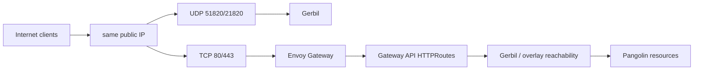

# Shared IP HTTP/HTTPS Envoy Migration

This path keeps one public IP, leaves Gerbil responsible for WireGuard traffic,
and moves only web traffic from Traefik to Envoy Gateway.

## Target Shape



This is "Envoy replaces Traefik" for HTTP/HTTPS only. Gerbil remains the
WireGuard/tunnel component and the old public endpoint for UDP. For tunneled
resources, Envoy must have the same backend reachability that Traefik had,
which may mean reaching resource networks through Gerbil or another cluster
route to the Gerbil-managed overlay.

## What The Upstream Helm Chart Does

The upstream chart supports controller mode, standalone mode, and single or
multi workload topology. In the chart README, controller mode is the
recommended production path and expects a Traefik controller; standalone mode
runs chart-managed Traefik; single mode puts Pangolin plus optional Gerbil and
either controller or standalone Traefik into one shared Pod.

Relevant chart behavior:

- `gerbil.service` is value-driven and selects Gerbil pods in multi mode, or
  the shared single Pod in single mode.
- Default Gerbil service ports are `wg1` UDP `51820`, `wg2` UDP `21820`, and
  `internal-api` TCP `3004`.
- Standalone Traefik listens on container ports `8000` and `8443`; its Service
  exposes public TCP `80` and `443` to those container ports.
- In single+standalone mode, one Service can target ports from both Gerbil and
  Traefik because all containers live in the same Pod network namespace.

Important consequence: the chart does not configure Gerbil as the HTTP/HTTPS
frontend that forwards port 80/443 to Traefik. Gerbil is not a drop-in L7
replacement for a LoadBalancer or Gateway. With standard Envoy Gateway, Envoy
data-plane pods are separate from the Pangolin/Gerbil pods, so a single
Kubernetes Service cannot select Gerbil for UDP and Envoy for TCP unless your
load balancer supports sharing one IP across multiple Services, or you put an
external L4 load balancer in front.

Sources checked:

- [Pangolin chart README](https://github.com/fosrl/helm-charts/blob/main/charts/pangolin/README.md)
- [Pangolin chart values](https://github.com/fosrl/helm-charts/blob/main/charts/pangolin/values.yaml)
- [Gerbil Service template](https://github.com/fosrl/helm-charts/blob/main/charts/pangolin/templates/service-gerbil.yaml)
- [Standalone Traefik Service template](https://github.com/fosrl/helm-charts/blob/main/charts/pangolin/templates/service-traefik.yaml)
- [Single Pod template](https://github.com/fosrl/helm-charts/blob/main/charts/pangolin/templates/deployment-single.yaml)

## Recommended Shared-IP Pattern

Use one public IP with two L4 owners:

- Gerbil public UDP Service owns UDP `51820` and `21820`.
- Envoy Gateway data-plane Service owns TCP `80` and `443`.

This requires one of:

- a load-balancer implementation that supports the same IP on multiple Services
  when their ports do not overlap, such as some MetalLB or Cilium LB IPAM
  setups;
- a cloud/provider feature that can bind different port mappings for the same
  IP to different Kubernetes Services;
- an external L4 load balancer that sends UDP ports to Gerbil and TCP ports to
  Envoy.

If your provider cannot share one IP across Services, Kubernetes cannot express
"UDP to Service A, TCP to Service B, same external IP" with ordinary Services.
Use the separate-IP migration first, or do a cutover where Envoy becomes the
only owner of the public IP.

## Keep The Chart Gerbil Service Internal

For a clean production setup, keep the chart-managed Gerbil Service as
`ClusterIP` so Gerbil's internal API stays internal:

```yaml
gerbil:
  service:
    enabled: true
    type: ClusterIP
```

Then create a separate public UDP Service outside the chart. Copy the selector
from the chart-rendered Gerbil Service:

```sh
kubectl -n pangolin-system get svc <release>-pangolin-gerbil -o yaml
```

Use the same selector in a UDP-only public Service:

```yaml
apiVersion: v1
kind: Service
metadata:
  name: gerbil-public-udp
  namespace: pangolin-system
  annotations:
    # Provider-specific static/shared IP annotations go here.
    example.com/shared-ip-group: pangolin-public
spec:
  type: LoadBalancer
  loadBalancerIP: OLD_PUBLIC_IP
  externalTrafficPolicy: Local
  selector:
    # Copy from the chart-rendered <release>-pangolin-gerbil Service.
    # These are examples; single mode uses the shared single-Pod selector.
    app.kubernetes.io/instance: RELEASE_NAME
    app.kubernetes.io/component: gerbil
  ports:
    - name: wg1
      protocol: UDP
      port: 51820
      targetPort: wg1
    - name: wg2
      protocol: UDP
      port: 21820
      targetPort: wg2
```

Avoid exposing Gerbil `internal-api` TCP `3004` on the public LoadBalancer.

## Put Envoy On TCP 80/443 Of The Same IP

Configure the Envoy Gateway data-plane Service with the same static IP and the
same provider-specific shared-IP group, but only for TCP `80` and `443`.

The exact object is Envoy Gateway installation dependent. In many clusters,
Envoy Gateway creates a Service in the Envoy namespace for the data-plane
Deployment. Patch or configure that Service through your Envoy Gateway
installation mechanism rather than hand-editing generated resources when your
operator supports a first-class value.

Schematic only:

```yaml
apiVersion: v1
kind: Service
metadata:
  name: envoy-gateway-data-plane
  namespace: envoy-gateway-system
  annotations:
    # Must match the Gerbil public UDP Service for providers that require a
    # shared-IP grouping key.
    example.com/shared-ip-group: pangolin-public
spec:
  type: LoadBalancer
  loadBalancerIP: OLD_PUBLIC_IP
  ports:
    - name: http
      protocol: TCP
      port: 80
    - name: https
      protocol: TCP
      port: 443
```

Make sure the final public IP ownership is non-overlapping:

```sh
kubectl -n pangolin-system get svc gerbil-public-udp
kubectl -n envoy-gateway-system get svc
```

You should see the same external IP on both Services, with UDP ports only on
Gerbil and TCP web ports only on Envoy.

## Gateway API Setup

Create or keep a parent Gateway that allows the controller's `ListenerSet` to
attach:

```yaml
apiVersion: gateway.networking.k8s.io/v1
kind: Gateway
metadata:
  name: eg
  namespace: envoy-gateway-system
spec:
  gatewayClassName: eg
  allowedListeners:
    namespaces:
      from: All
  listeners:
    - name: placeholder
      protocol: HTTP
      port: 8080
```

Then configure the Pangolin Gateway API controller for Envoy:

```yaml
- name: CONFIG_PARENT_GATEWAY
  value: "eg"
- name: CONFIG_PARENT_GATEWAY_NAMESPACE
  value: "envoy-gateway-system"
- name: CONFIG_ENABLE_HTTPS_LISTENERS
  value: "true"
- name: CONFIG_TLS_SECRET_TEMPLATE
  value: "{hostname-dashed}-tls"
- name: CONFIG_BADGER_EXT_AUTH
  value: "true"
- name: CONFIG_BADGER_EXT_AUTH_BACKEND_NAME
  value: "pangolin-badger-ext-authz"
- name: CONFIG_RECONCILE_ONLY
  value: "first-test-resource.example.com"
```

Once the selected hostname works through Envoy, remove
`CONFIG_RECONCILE_ONLY`.

## Pangolin Dashboard

If the Pangolin dashboard should also move from Traefik to Envoy, disable or
ignore the Traefik dashboard `IngressRoute` and enable the controller's Gateway
API dashboard routes:

```yaml
- name: CONFIG_PANGOLIN_DASHBOARD_HOST
  value: "pangolin.example.com"
```

The Pangolin Service must expose:

- API/WebSocket port `3000` via `CONFIG_PANGOLIN_API_PORT`
- Next.js UI port `3002` via `CONFIG_PANGOLIN_NEXT_PORT`

## Critical Reachability Check

Replacing Traefik with Envoy is only safe if Envoy can reach the same resource
backends Traefik reached.

The upstream chart's single+standalone mode can make Traefik and Gerbil share a
Pod network namespace. Standard Envoy Gateway data-plane pods do not share that
namespace. If your current Traefik reaches tunneled resources only because it is
co-located with Gerbil, Envoy may not have equivalent reachability by default.

Before moving production traffic:

```sh
kubectl -n <controller-namespace> get httproute
kubectl -n <controller-namespace> get securitypolicy
kubectl -n <controller-namespace> get svc,endpointslice
kubectl -n envoy-gateway-system logs deploy/<envoy-data-plane-deployment>
```

Then test a single hostname through the shared IP. Confirm:

- TLS terminates at Envoy.
- Badger auth redirects or allows as expected.
- The selected route can reach its backend.
- Gerbil UDP tunnels still connect through the same public IP.

## Cutover Checklist

1. Keep Traefik serving production HTTP/HTTPS.
2. Add Envoy on the shared IP for TCP `80` and `443`, if your LB supports that.
3. Keep Gerbil UDP on the same IP and do not expose `internal-api` publicly.
4. Scope the controller with `CONFIG_RECONCILE_ONLY=<hostname>`.
5. Validate one protected hostname and the Pangolin dashboard.
6. Move DNS/traffic policy from Traefik to Envoy for HTTP/HTTPS.
7. Remove Traefik's public Service or stop exposing ports `80` and `443` from
   Traefik.
8. Remove `CONFIG_RECONCILE_ONLY`.

If the load balancer cannot share one IP across Services, stop here and use the
separate-IP guide until you are ready for a full public-IP cutover.
